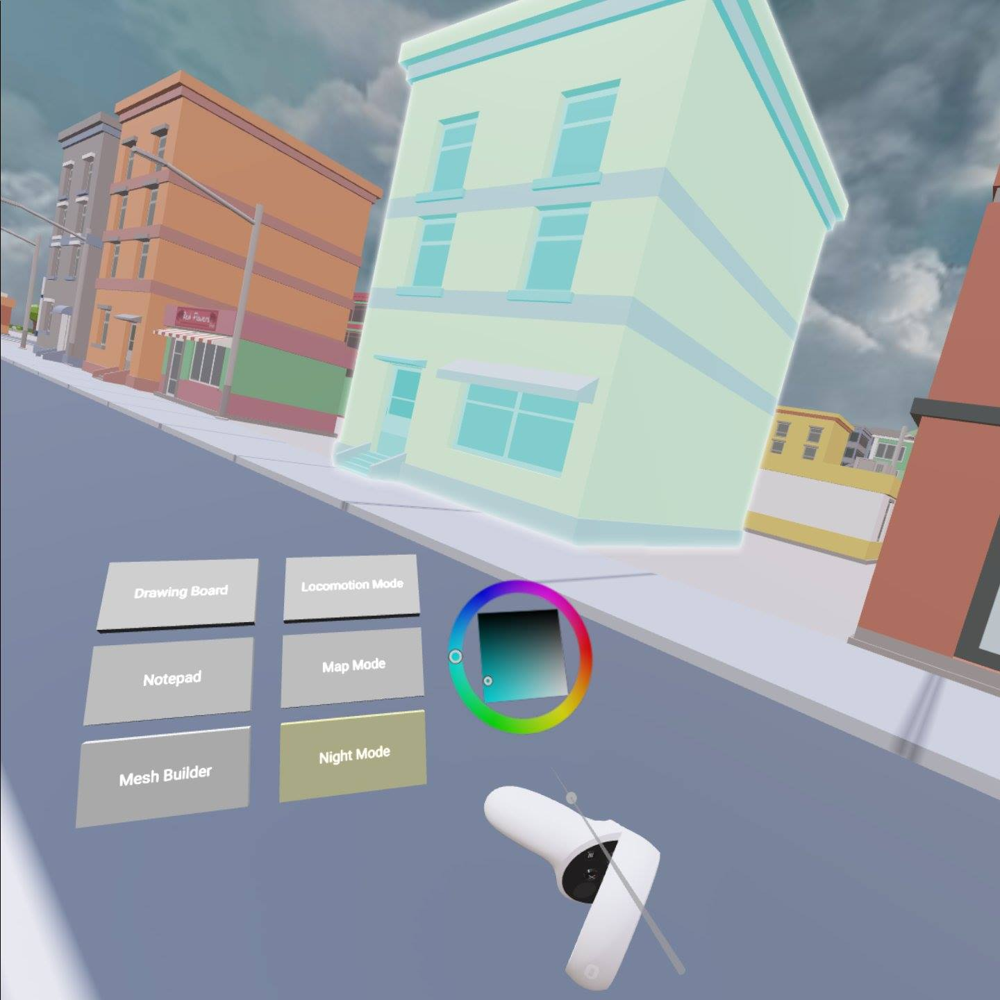
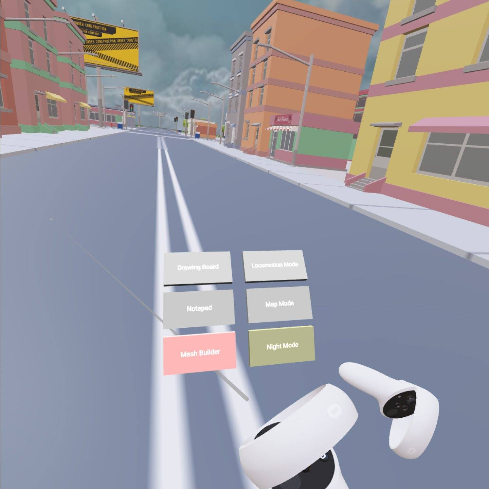
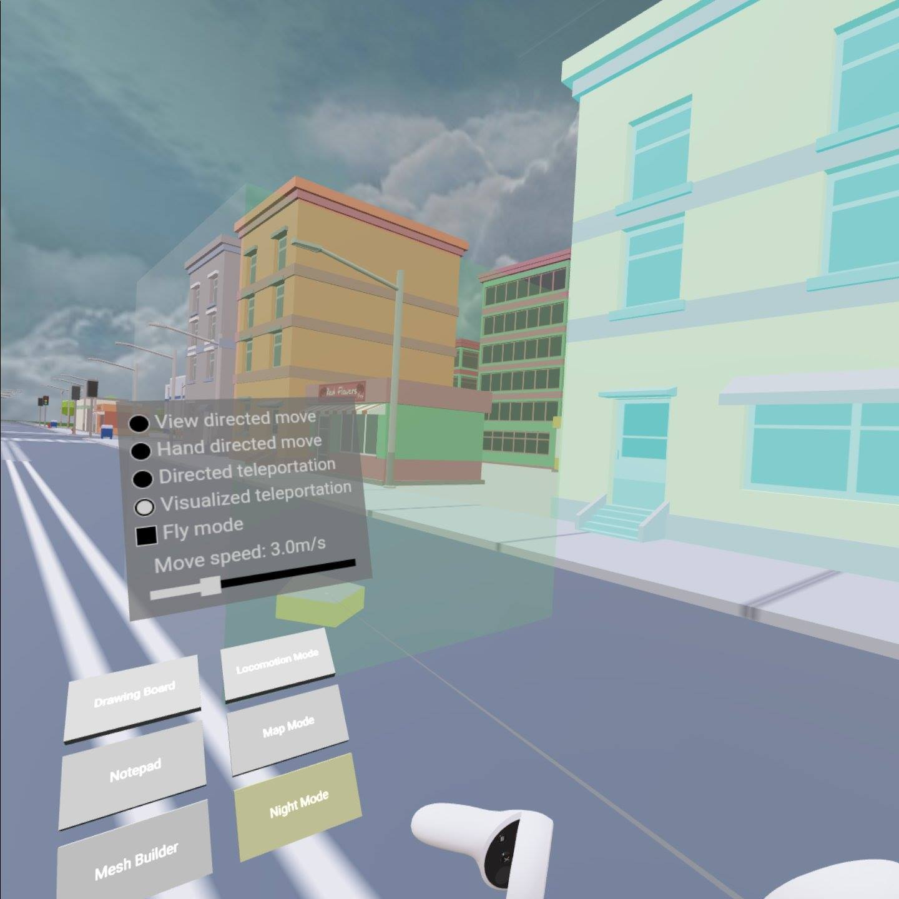
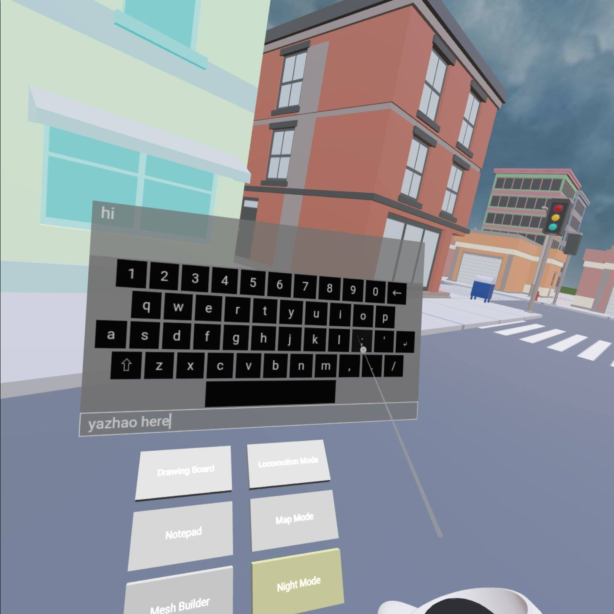
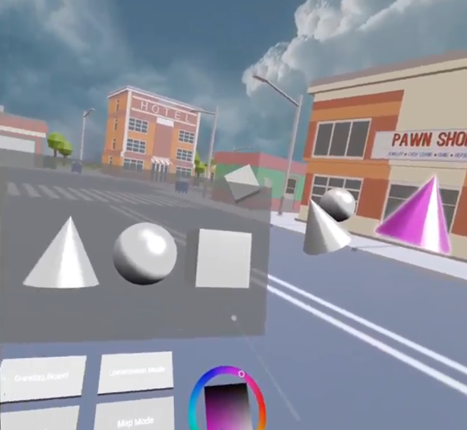
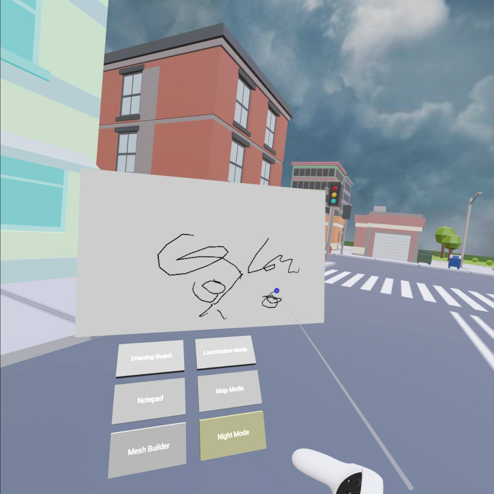
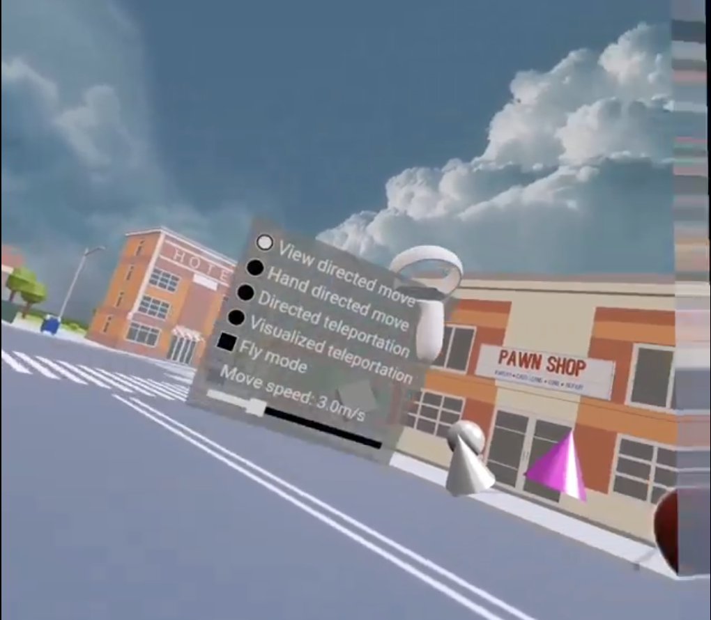
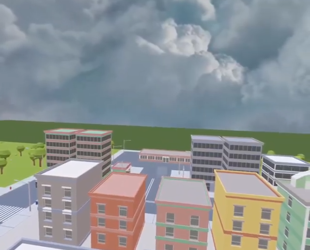

# Project - Omnitool and Immersive Map

### Yazhao Li - li001650@umn.edu
### Anlan Zhang - zhan6841@umn.edu

---

## Introduction

In our project, we design and implement an omnitool and an immersive map system specific for VR applications, such as VR games. Our work includes:

* Motivated by some popular sci-fi games, we implement a simple and intuitive graphic menu which is based on the gesture of the user's left forearm for our omnitool. As shown in the following figure, when the user raises his/her left forearm, the graphic menu will automatically show up. When the user puts down the arm, it will shut down. 

* We enable complex selection/manipulation tasks for the menu using the right controller of the user, consisting of:
  * The user can select a mesh and change the color attribute using the button in the menu.
  
  * Selecting buttions of the graphic menu. (Choosing different modes)
  
  * In the locomotion mode, the user can use the right controller to choose the locomotion method as well as the move speed.
  
  * In the Notepad mode, the user can use the right controller and a keyboard to type.
  
  * In the Mesh Builder, the user can use the right controller to grab a basic mesh from the menu into the real scene and then use the button in the menu to change its color.
  

* We also allow user to directly operate on the menu in some extra modes, including:
  * In the drawing board, the user can use the right controller to directly draw on a board.
  
  * In the Notepad mode, the user can use the right controller and a keyboard to type.
  

* The user is able to drag out some tabs on the menu and pin them as a HUD that keeps showing a in fixed position in the user's viewport. For example, the selection tab in the Locomotion Mode.
  

* We create an immersive map system and integrate it into our omnitool. The user can use the right controller and select the Map Mode to enter/exit the immersive map. The map is generated based on the user's current location. We also enable some selection/manipulation tasks for the user when in the Map Mode. For example, the user can use the left controller to zoom in/out and use the right controller to teleport himself/herself to a new place. 
  

## Build URL
http://www-users.cselabs.umn.edu/~li001650/Project/

## Third Party Assets:

* [SimplePoly - Town Pack by Gnome's Artworks](https://assetstore.unity.com/packages/3d/environments/*simplepoly*-town-pack-62400)

* Skybox from babylonjs playground assets

## Custom GUI Instructions:

1. Raise left arm to open the GUI.
2. Use right controller's laser pointer to interact with buttons, panels, and meshes.
3. Use right grip button to drag panel and create new meshes.
4. Use left grip button to reset and force show GUI.
